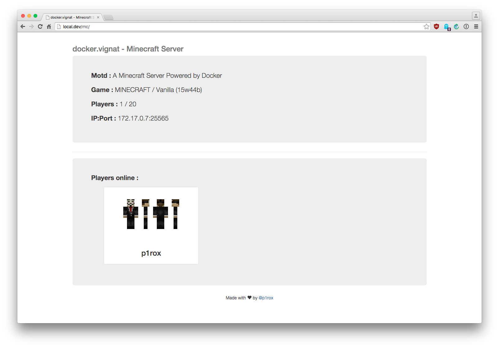

# Minecraft-Server-Web-Viewer

## Requierements

- Web server (nginx or Apache)
- PHP and composer
- Minecraft Server ;)

## Install 

1. Clone this repo into your web folder.
2. Go into the folder and execute `composer install`
3. Edit `index.php` to setup your Minecaft Server IP and query port.
4. Enjoy !